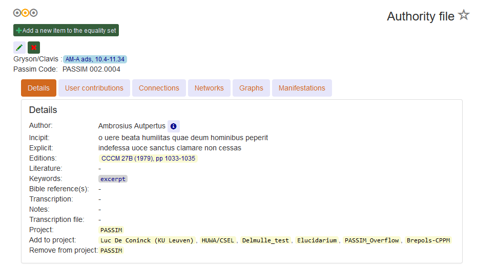
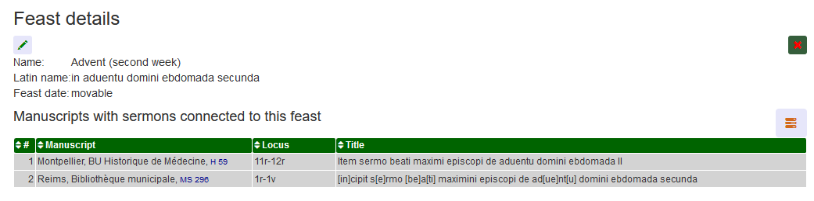

.. _basicdetails:

Basic Details View
==================

The Passim Utilities allow defining a generic details view with the following characteristics:

1. Separate 'xxxDetailsView' and 'xxxEditView' classes need to be defined in ``views.py``
2. The 'xxxDetailsView' class must derive from the 'xxxEditView' one (see below)
3. No template needs to be specified neither for the Details nor for the Edit view: two generic templates are used (``basic_details.html``, ``basic_edit.html``) internally

The following sections describe how to write the EditView and the DetailsView.

**Notes**:

#. The *name* for these views in ``urls.py`` needs to use the same ``basic_name`` as used for the BasicListView.
#. It is possible to generate some views automatically: 

   * Enter the correct virtual environment
   * Call manage: ``python manage.py addview <app> <model>``, where ``<app>`` is the name of the django app that resides inside ``<model>``
   * Review the output code and place it in the correct ``models.py``, ``views.py``, ``forms.py`` etc.

EditView basics
---------------

The name of the EditView in ``urls.py`` must be like ``author_edit``, if ``author`` is the ``basic_name`` (in BasicListView).
If the ``basic_name`` is not the same as the name of the model, then it needs to be specified.

Here is an example of an EditView:

.. code-block:: python
   :linenos:

   class EqualGoldEdit(BasicDetails):
      model = EqualGold
      mForm = SuperSermonGoldForm
      prefix = 'ssg'
      title = "Super Sermon Gold"
      rtype = "json"   
      mainitems = []

      def add_to_context(self, context, instance):
         """Add to the existing context"""

         # Define the main items to show and edit
         context['mainitems'] = [
            {'type': 'plain', 'label': "Author:",      'value': instance.author, 
             'field_key': 'author', 'field_ta': 'authorname', 'key_ta': 'author-key'},
            {'type': 'plain', 'label': "Number:",      'value': instance.number},
            {'type': 'plain', 'label': "Passim Code:", 'value': instance.code}
            ]
         # Return the context we have made
         return context
      
*Attributes*
      
The EditView derives from the class ``BasicDetails``. A lot is defined generically because of the flag **is_basic** that is set to ``True``.
In fact, there are but a few things that need to be specified for the EditView:

   ``model`` - the name of the model class that this edit view is based on
   
   ``mForm`` - the name of the model form class that this edit view uses (define this in ``forms.py``)
   
   ``prefix`` - the prefix that is used to show and identify elements of the form
   
   ``title`` - the verbose name for this item. This can differ from the model name. The latter here is 'EqualGold', whereas the verbose name is 'Super Sermon Gold'.
   
   ``rtype`` - this needs to be set to **json** for the EditView
   
   ``mainitems`` - an empty array that is specified fully in ``add_to_context()``
   
   ``is_basic`` - obligatory for the EditView and the DetailsView: must be set to ``True``
   
*Methods*

The EditView must have an ``add_to_context()`` method, as shown in the example above.
The ``mainitems`` list in the context contains one object for each field that needs to be displayed.
Each description has at least values for ``type``, ``label`` and ``value``.
The descriptions for the user-editable fields should have values for at least ``field_key``.

Here is a short description of the field-description object:

.. table::
    :widths: auto
    :align: left
    
    ================= ==========================================================================
    key               meaning
    ================= ==========================================================================
    ``*type``         normally 'plain'. Alternatives: ``bold``, ``line``, ``safe``, ``safeline``
    ``*label``        the label shown in the details view for this item
    ``*value``        the value to be displayed (use ``instance`` to derive it)
    ``[link]``        the URL that the user can link to from this value (provided type=``bold``)
    ``[title]``       the popup text displayed when hovering over
    ``[multiple]``    boolean that indicates whether this field may contain multiple values
    ``[align]``       the alignment of the ``<td>``
    ``[field_key]``   the name of the form field for this item
    ``[field_ta]``    the name of the typeahead form field for this item
    ``[key_ta]``      the 'key' used for typeahead (CSS class name, e.g. "author-key")
    ``[field_list]``  the name of the select2 form field (multi-valuable)
    ================= ==========================================================================

Note that the ``add_to_context()`` method may also be used to define deviating values for ``afterdelurl`` and ``afternewurl``.

EditView sections
-----------------

One variant of the ``EditView`` allows breaking up a long list of fields into sections, which can be opened or closed with buttons.

The illustration above shows how this looks like in the Passim details view of the 'Authority File'. 
The elements from the ``mainitems`` list are very few (appearing just above 'Details').
Then there are 6 sections (Details, User contributions, Connections, Networks, Graphs, Manifestations) that can each be
opened or closed using a button. The section 'Details' opens by default.
Here is the code (within ``add_to_context()``) that implements this divide-by-section strategy:

.. code-block:: python
    :linenos:
     
        context['mainsections'] = [
        {'name': 'Details', 'id': 'equalgold_details', 'show': True, 'fields': [                
            {'type': 'line',  'label': "Author:", 'value': instance.author_help(info), 'field_key': 'newauthor', 'order': 1},                
            {'type': 'plain', 'label': "Incipit:", 'value': instance.incipit,   'field_key': 'incipit',  'empty': 'hide', 'order': 2},
            {'type': 'safe',  'label': "Incipit:", 'value': instance.get_incipit_markdown("search"), 
                'field_key':  'newincipit',  'key_ta': 'gldincipit-key', 'title': instance.get_incipit_markdown("actual"), 'order': 2}, 
            {'type': 'plain', 'label': "Explicit:", 'value': instance.explicit,  'field_key': 'explicit', 'empty': 'hide', 'order': 3},                 
            {'type': 'safe',  'label': "Explicit:", 'value': instance.get_explicit_markdown("search"),
                'field_key':  'newexplicit', 'key_ta': 'gldexplicit-key', 'title': instance.get_explicit_markdown("actual"), 'order': 3}, 
            {'type': 'line',  'label': "Editions:", 'value': instance.get_editions_markdown(),
                'title':      'All the editions associated with the Gold Sermons in this equality set', 'order': 4},
            {'type': 'line',  'label': "Literature:", 'value': instance.get_litrefs_markdown(), 
                'title':      'All the literature references associated with the Gold Sermons in this equality set', 'order': 6},
            {'type': 'line',  'label': "Keywords:", 'value': instance.get_keywords_markdown(), 'field_list': 'kwlist', 'order': 7},
            {'type': 'plain', 'label': "Bible reference(s):", 'value': instance.get_bibleref(),        
                'multiple': True, 'field_list': 'bibreflist', 'fso': self.formset_objects[2], 'order': 8},                
            {'type': 'safe',  'label': "Transcription:", 'value': self.get_transcription(instance),
                'field_key':  'newfulltext', 'order':9},
            {'type': 'plain', 'label': "Notes:",     'value': instance.raw, 'order':10},
            {'type': 'line',  'label': "Project:",     'value': instance.get_project_markdown2(), 'order':12},                
                ]},            
            
        {'name': 'User contributions', 'id': 'equalgold_usercontributions', 'fields': [
            {'type': 'plain', 'label': "Keywords (user): ", 'value': self.get_userkeywords(instance, profile, context), 
                'field_list': 'ukwlist', 'title': 'User-specific keywords. If the moderator accepts these, they move to regular keywords.'}, # plain?
            {'type': 'line',  'label': "Personal datasets:", 'value': instance.get_collections_markdown(username, team_group, settype="pd"), 
                'multiple': True, 'field_list': 'collist_ssg', 'fso': self.formset_objects[0] },
            ]},
            
        {'name': 'Connections', 'id': 'equalgold_connections', 'fields': [                
            {'type': 'line',  'label': "Equality set:", 'title': 'The gold sermons in this equality set',  'value': self.get_goldset_markdown(instance), 
                'field_list': 'goldlist', 'inline_selection': 'ru.passim.sg_template' },                
            {'type': 'line',  'label': "Historical collections:",   'value': instance.get_collections_markdown(username, team_group, settype="hc"), 
                'field_list': 'collist_hist', 'fso': self.formset_objects[0] },
        ]

        # Other sections will be filled in later
        context['mainsections'] += [            
            {'name': 'Networks',        'id': 'equalgold_networks',         'button': True, 'fields': [ 
                ]},
            {'name': 'Graphs',          'id': 'equalgold_graphs',           'button': True, 'fields': [ 
                ]},
            {'name': 'Manifestations',  'id': 'equalgold_manifestations',   'button': True, 'fields': [ 
                ]},
            ] 

Note the difference between the first three sections (Details ... Connections) and the last three sections (Networks ... Manifestations).
The first three sections contain editable fields, which is why the specification of their contents **needs** to be part of the ``EditView`` code.
The last three sections do *not* contain any editable fields. They only contain visualizations (Networks, Graphs)
and a 'details-listview' (a listview that is shown below a details view).
The contents of these sections should therefore be specified in the ``DetailsView`` code.

.. code-block:: python
    :linenos:

    # Specify the *contents* of the sections via separate templates
    context['sections'] = [
                    
        {'name': 'Networks', 'id': 'equalgold_networks', 'nobutton': True, 'fields': [ 
            ], 'template': 'seeker/af_networks.html'},
        {'name': 'Graphs', 'id': 'equalgold_graphs',  'nobutton': True,'fields': [ 
            ], 'template': 'seeker/af_graphs.html'},
        {'name': 'Manifestations', 'id': 'equalgold_manifestations', 'nobutton': True, 'fields': [ 
            ], 'template': 'seeker/af_manifestations.html'},
                ] 

Please see the actual code of ``class EqualGoldDetails`` on 
`GitHub <https://github.com/ErwinKomen/RU-passim/blob/master/passim/passim/seeker/views.py>`_
for further details on how these sections were treated in the Passim project.
                     

DetailsView
-----------

The name of the DetailsView in ``urls.py`` must be like ``author_details``, if ``author`` is the ``basic_name`` (in BasicListView).
If the ``basic_name`` is not the same as the name of the model, then it needs to be specified.

Here is an example of a DetailsView:

.. code-block:: python
   :linenos:

   class EqualGoldDetails(EqualGoldEdit):
      rtype = "html"

      def add_to_context(self, context, instance):
         """Add to the existing context"""

         # Start by executing the standard handling
         super(EqualGoldDetails, self).add_to_context(context, instance)

         context['sections'] = []
         
         related_objects = []

         context['related_objects'] = related_objects
         # Return the context we have made
         return context

*Attributes*
         
The details view class is based on the EditView class. It is from that class that it inherits the ``model``, the ``mForm``, the prefix, the title and so forth.
What remains to be specified for the DetailsView is that ``rtype`` parameter: that should be set to *html*.

*Methods*

In terms of *methods*, the DetailsView is not obliged to specify anything.
It already inherits the ``mainitems`` from the EditView.
However, the DetailsView usually contains more information than just the 'basic' fields of a model.
The generic details view allows specifying two additional matters:

1. ``sections``: Sets of object details that are hidden by default, but appear when pressing a button
2. ``related_objects``: listviews of objects that link with it.

*Sections*

The ``sections`` list can be filled with specifications of buttons the user can click to view information associated with 
the current details view. Such information could be: images, graphs, other visualizations.

*Related Objects*

The ``related_objects`` is a list of objects. Each related object boils down to a **table** that is shown with a list of objects.
The section 'Details listview' explains how to use these related objects.

Details listview
----------------

A details view can optionally contain one or more listviews, which are implemented as tables.
The example further down shows the details view of a Feast, that contains a listview of manuscripts with sermons.
The detail view's listview tables are specified in the context variable ``related_objects`` as a list of objects.
A related object can have the following fields:

.. table::
    :widths: auto
    :align: left
    
    ================= ============================================================================
    key               meaning
    ================= ============================================================================
    ``*title``        a title of this table shown to the user
    ``*columns``      a list of names (strings) for each of the columns to be shown
    ``*rel_list``     a list of related item objects (the rows in the table to be shown)
    ``*prefix``       short prefix that uniquely identifies this related object
    ``[use_counter]`` boolean: True means that each line in the table must have a number
    ``[editable]``    boolean: True means that add/edit/delete options are added
    ================= ============================================================================

Note that when ``editable`` is set to True, and the user has editing rights, several items are added.
Each row gets an 'edit' button and a 'delete' button. The table as a whole gets an additional row that forms the 'add' button.
The add facility makes use of a hidden empty row that is added.

Each item in the ``rel_list`` is an object that can have the following fields:

.. table::
    :widths: auto
    :align: left
    
    ================= ============================================================================
    key               meaning
    ================= ============================================================================
    ``*value``        the HTML of what is shown in this row
    ``[title]``       a popup title shown when a user hovers over this row
    ``[link]``        a link (URL) to which the user is directed when pressing this row
    ================= ============================================================================

.. code-block:: python
   :linenos:

    # List of Sermons that link to this feast (with an FK)
    sermons = dict(title="Manuscripts with sermons connected to this feast", prefix="tunit")
    sermons['gridclass'] = "resizable"

    rel_list =[]
    # Note: specify the default sort order here
    qs = instance.feastsermons.all().order_by('msitem__manu__lcity__name', 'msitem__manu__library__name', 'msitem__manu__idno', 'locus')
    for item in qs:
        manu = item.msitem.manu
        url = reverse('sermon_details', kwargs={'pk': item.id})
        url_m = reverse('manuscript_details', kwargs={'pk': manu.id})
        rel_item = []

        # S: Order number for this sermon
        add_rel_item(rel_item, index, False, align="right")
        index += 1

        # Manuscript
        manu_full = manu.get_full_name(plain=False)
        add_rel_item(rel_item, manu_full, False, main=False, nowrap=False, link=url_m)

        # Locus
        locus = "(none)" if item.locus == None or item.locus == "" else item.locus
        add_rel_item(rel_item, locus, False, main=False, nowrap=False, link=url, 
                        title="Locus within the manuscript (links to the manifestation)")

        # Title
        title = item.get_title()
        add_rel_item(rel_item, title, False, main=False, nowrap=False, link=url, 
                        title="Manifestation's title (links to the manifestation)")

        # Add this line to the list
        rel_list.append(dict(id=item.id, cols=rel_item))

    sermons['rel_list'] = rel_list

    sermons['columns'] = [
        '{}#{}'.format(sort_start_int, sort_end), 
        '{}Manuscript{}'.format(sort_start, sort_end), 
        '{}Locus{}'.format(sort_start, sort_end), 
        '{}Title{}'.format(sort_start, sort_end), 
        ]
    related_objects.append(sermons)

    # Add all related objects to the context
    context['related_objects'] = related_objects

The code and the image above shows how `Passim's <https://github.com/ErwinKomen/RU-passim/blob/master/passim/passim/seeker/views.py>`_ 
view ``FeastDetails`` specifies a listview of manuscript sermons that are associated with the Feast of the 
feast's details view. 

Note that items (specifications of each cell) in the list are added with the help of the function ``add_rel_item()``, 
which can be imported and used from the Basic Utilities ``views.py``. 
This is a list of the arguments used by ``add_rel_item()`` and their function.

.. table::
    :widths: auto
    :align: left
    
    ================= ===========================================================================
    key               meaning
    ================= ===========================================================================
    ``*rel_item``     list to which each 'item' (specification of a table cell) must be added
    ``*value``        string or integer value to be placed in the cell
    ``[resizable]``   set to True, if the column should be 'small' initially
    ``[title]``       the popup text displayed when hovering over
    ``[align]``       the alignment of the ``<td>``: "left" (default) or "right"
    ``[link]``        the URL to be used when clicking on this cell
    ``[nowrap]``      if True, the string in this cell may not be wrapped (must be on one line)
    ``[main]``        if True, this is the cell receiving maximum width
    ``[draggable]``   if True, the cell (usually the first cell) may be used to change line order
    ================= ===========================================================================

Having a many-to-one element
----------------------------

Suppose there is a details view and an edit view for an item of type ``Publisher``.
Suppose, then, that there is an item ``Book`` that links with a foreign key to Publisher.
It will have a field ``name`` for the name of the book and a field ``publisher`` linking to the ``Publisher``.

.. code-block:: python
   :linenos:

    class Book(models.Model):
        """A book can contain a number of chapters and it belongs to a library"""

        # [1] Name of the manuscript (that is the TITLE)
        name = models.CharField("Name", max_length=LONG_STRING, blank=True, default="")
        # [0-1] One book can only belong to one particular publisher
        publisher = models.ForeignKey(Publisher, null=True, blank=True, on_delete = models.SET_NULL, related_name="publisher_books")

The implication is: there is a many-to-one relation between Book and Publisher.
How can the 'books' be added to the details view of ``Publisher``? 
The user should be able to select or describe a book and add it to that publisher.
The user should also be able to delete a book from a publisher.
Here are the steps:

#. Forms

   a. Adapt the ``PublisherForm``, so that it contains a list of books for this publisher:
   
       * Add an element ``booklist`` to the form
       * Initialize the `queryset` and `initial` values of ``booklist`` in method ``__init__()``

         .. code-block:: python
            :linenos:

            class PublisherForm(BasicModelForm):
                booklist = ModelMultipleChoiceField(queryset=None, required=False,
                    widget=BookWidget(attrs={'data-minimum-input-length': 0, 'data-placeholder': 'Select books...', 'style': 'width: 100%;'}))

                class Meta:
                    ATTRS_FOR_FORMS = {'class': 'form-control'};

                    model = Publisher

                def __init__(self, *args, **kwargs):
                    # Start by executing the standard handling
                    super(PublisherForm, self).__init__(*args, **kwargs)

                    # Need to initialize the lists
                    self.fields['booklist'].queryset = Book.objects.all()

                    # Get the instance
                    if 'instance' in kwargs:
                        instance = kwargs['instance']
                        # Get the values for the already available books belonging to this publisher
                        self.fields['booklist'].initial = [x.pk for x in instance.publisher_books.all()]

   a. Make sure to have a form ``PublisherBookForm``:
       
       * Make it have a field like ``newname`` where the user can add a new name of a book for a publisher
       * Have the property `required` set to `False`

         .. code-block:: python
            :linenos:

            class PublisherBookForm(BasicModelForm):
                newname = forms.CharField(required=False, help_text='editable', 
                    widget=forms.TextInput(attrs={'class': 'input-sm', 'placeholder': 'Book name...',  'style': 'width: 100%;'}))

                class Meta:
                    ATTRS_FOR_FORMS = {'class': 'form-control'};

                    model = Book
                    fields = ['name']
                    widgets={'name':   forms.TextInput(attrs={'style': 'width: 100%;'}),

#. Model: process ``Publisher``

   a. Add a method like ``get_books_markdown()`` that creates a HTML string to show the names of the books belonging to a publisher.

      .. code-block:: python
         :linenos:

         class Publisher(models.Model):
            """A publisher that publishes multiple books"""

            # [1] Name of the codicological unit (that is the TITLE)
            name = models.CharField("Name", max_length=LONG_STRING, blank=True, default="")

            def get_books_markdown(self):
                """Get the books of this publisher as a HTML string"""

                lhtml = []
                # Get all the books in the correct order
                qs = self.publisher_books.all().order_by('name')
                # Walk the book objects
                for obj in qs:
                    # Determine the output for this one daterange
                    item = "
{} ({})
".format(obj.name, obj.year)
                    lhtml.append(item)

                return "\n".join(lhtml)

#. View: the Publisher's detail view

   a. There needs to be a formset that provides a set of forms linking ``Publisher`` with ``Book``
   #. Method ``add_to_context()``: Make sure the Books are mentioned in ``context['mainitems']``

         .. code-block:: python
            :linenos:

            class PublisherEdit(BasicDetails):
                """The details of one publisher: its name and the books it has"""

                model = Publisher
                mForm = PublisherForm

                BookFormSet = inlineformset_factory(Publisher, Book,
                                                     form=PublisherBookForm, min_num=0,
                                                     fk_name = "publisher",
                                                     extra=0, can_delete=True, can_order=False)
                formset_objects = [
                    {'formsetClass': BookFormSet, 'prefix': 'pbk', 'readonly': False, 'noinit': True, 'linkfield': 'publisher'}]

                def add_to_context(self, context, instance):
                    """Add to the existing context"""

                    oErr = ErrHandle()
                    try:
                        # Get the main items
                        mainitems_main = [
                            {'type': 'plain', 'label': "Name:",     'value': instance.name,    'field_key': 'name'},
                            {'type': 'line',  'label': "Books:",    'value': instance.get_books_markdown(), 
                             'multiple': True, 'field_list': 'booklist', 'fso': self.formset_objects[0]}, 
                            ]
                    except:
                        msg = oErr.get_error_message()
                        oErr.DoError("PublisherEdit/add_to_context")

                    # Return the context we have made
                    return context

   #. Method ``process_formset()``: make sure the form's ``newname`` is handled properly
    
      .. code-block:: python
         :linenos:

         def process_formset(self, prefix, request, formset): 
            """Process a formset with a particular prefix"""
            instance = formset.instance

            # Walk all the forms in this formset
            for form in formset: 
                if form.is_valid():
                    cleaned = form.cleaned_data
                    # Action depends on prefix
                    if prefix == "pbk":
                        # Book name processing
                        newname = cleaned.get("newname")
                        if not newname is None:
                            # Double check if a book with this name is already connected to [instance] or not
                            obj = Book.objects.filter(name=newname, publisher=instance).first()
                            if obj is None:
                                # It is not there yet: add it
                                form.instance.name = newname
                        # Note: it will get saved with form.save()

                else:
                    errors.append(form.errors)
                    bResult = False
            return None

   #. Method ``after_save()``:  make sure the procedure ``adapt_m2o()`` is called correctly

      .. code-block:: python
         :linenos:

         def after_save(self, form, instance):
            msg = ""
            bResult = True
            oErr = ErrHandle()
        
            try:
                # (1) links from Book to Publisher
                booklist = form.cleaned_data['booklist']
                adapt_m2o(Book, instance, "publisher", booklist)
            except:
                msg = oErr.get_error_message()
                bResult = False
            return bResult, msg

Having a many-to-many element
-----------------------------

Continuing the example of a ``Publisher`` with ``Book`` items connected to it, suppose this publisher contains
books from two or three (or more) different projects. There's a model ``Project``.
Each book may be part of one or more projects. This means that here should be a many-to-many relation
between ``Book`` and ``Project``. To provide that link, we have a table ``BookProject`` that has a foreign key to a ``Book`` and one to a ``Project``.
To complicate it a bit more, suppose we want to be able to define the 'history' of a particular book in a particular project.
This history field could contain notes as to when the book became part of the project and things like that.
This means we now have a field ``status`` added to the ``BookProject`` model:

.. code-block:: python
   :linenos:

   class BookProject(models.Model):
      """Relation between a Book and a Project"""

      # [1] The link is between a Book instance ...
      book = models.ForeignKey(Book, related_name="book_proj", on_delete=models.CASCADE)
      # [1] ...and a project instance
      project = models.ForeignKey(Project, related_name="book_proj", on_delete=models.CASCADE)
      # [0-1] And a status: any text describing the status
      status = models.TextField(null=True, empty=True)

The question now is: how can we facilitate a (select2-based) interface in the details view to add a book to a particular project or to delete that relation?
Here are the steps:

#. Forms

   (#) Adapt the ``BookForm``, so that it shows *existing* book-project combinations and allows deleting these: 
   
       * Add an element ``booklist`` to the form. This booklist should make use of a Select2 widget of class ``ModelSelect2MultipleWidget``
       * Initialize the `queryset` and `initial` values of ``booklist`` in method ``__init__()``

   (#) Make sure to have a form ``BookProjectForm``:
       
       * Its Meta-defined required fields are: ``fields = ['book', 'project']``
       * Add a 'free' ``ModelChoiceField`` field ``project__new`` to it. The ``project_new`` field should make use of a Select2 widget of class ``ModelSelect2Widget`` (i.e. **not** ``Multiple``). This form field is used to select one single project in a select2 dropdown list.
       * Make it have a field like ``newstatus`` where the user can add text for the status field
       * Have the property `required` set to `False`

#. Model: process ``BookProject``

   (#) Add a method like ``get_bookproject_markdown()`` that creates a HTML string to show the details of a book-project combination (including possibly status).

#. Views

   (#) There needs to be a formset that provides a set of forms linking ``Project`` with ``Book``
   (#) Method ``add_to_context()``: Make sure the Books are mentioned in ``context['mainitems']``
   (#) Method ``process_formset()``: make sure the form's ``newstatus`` and ``project__new`` are handled properly. The ``newstatus`` information should be put into the field ``status``, while the ``project__new`` information should be used to select the correct Project.
   (#) Method ``after_save()``:  make sure the procedure ``adapt_m2m()`` is called correctly

History button
--------------

The ``basic`` details view provides a method to show the edit history in a standardized way. 
If activated, the method adds a 'History' button to the details view.

#. Activation

#. Notes

