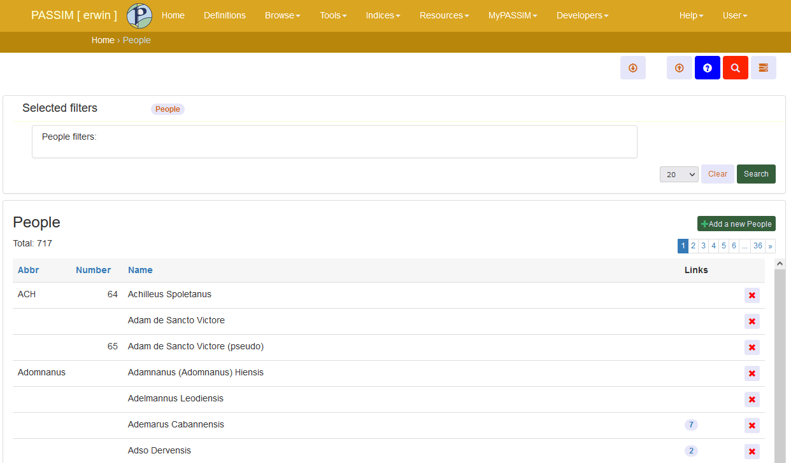

Basic List View
===============

.. _basiclist:

Creating and using the ``BasicList`` class is illustrated by the ``AuthorListView`` example.

.. code-block:: python
   :linenos:
   
   class AuthorListView(BasicList):
      """Search and list authors"""
	    
      model = Author
      listform = AuthorSearchForm
      has_select2 = True
      prefix = "auth"
      basic_name = "author"
      paginate_by = 20
      new_button = True
      delete_line = True
      page_function = "ru.passim.seeker.search_paged_start"
      order_cols = [...]            # See comments below
      order_default = order_cols
      order_heads = [...]           # See comments below
      filters = [ ...]              # See comments below
      searches = [...]              # See comments below
      downloads = [...]             # See comments below
      uploads = [...]               # See comments below

      def get_field_value(self, instance, custom):
         sBack = ""
         sTitle = ""
         return sBack, sTitle

      def add_to_context(self, contect, initial):
         return context

The ``AuthorListView`` is based on the view ``BasicList``, which is provided by the basic app.
The ``BasicList`` class extends the Django-provided regular ``ListView`` class.
This  means that it comes with all the standard listview methods and attributes.
Here is a discussion of the attributes and methods that are more specific to ``BasicList``.

Attributes
----------

``model``
   The name of the model that is the basis for the listview. The model should have been imported (e.g. from ``app``/models).
   
``listform``
   This is the form (specified e.g. in ``app``/forms and imported from there) that specifies all the fields that are needed in *searching*.

``has_select2``   
   Set it to ``True`` when one of the search options uses select2.

``prefix``
   This is the prefix to be used for this particular listview. Make sure to use non-identical prefixes between views. The prefixes are used in Javascript and in distinguishing information that is sent to the server via POST commands.

``basic_name``
   This is the basic name that is used in ``urls.py``, for instance, to derive the obligatory associated details view. 
   That is to say, there **must** be a DetailsView that has an entry in ``urls.py`` called ``basic_name`` + ``_details``.
   The ``basic_name`` does not actually need to be specified, when the name of the model (disregarding capitals)  ``Author`` is the same.

``paginate_by``
   The default value is 15 lines per page. Specify it here if you would like to have a different page size.

``delete_line``
   Set to ``True`` if one wants the listview to show a deletion `X` on every row. 
   This is visually not very nice, but it allows the user to delete items directly from the listview.
   The alternative deletion is within the details view.

``page_function``
   Provide the full path to a JavaScript function that is called when the user clicks on a particular page of the listview. If not specified, the default function will be used. See ``basic.js``, function ``search_paged_start()``.

``new_button``
   Set to ``True`` if a button should be added to allow a user to create a new item.

``order_cols``
   This is a list of strings representing *all* the columns available in the listview.
   A column that doesn't require ordering is represented by an empty string.
   Each column in ``order_heads`` should have one representative in ``order_cols``.
   The string of each column that requires ordering should be the field used in ordering.

   .. code-block:: python

      order_cols = ['abbr', 'number', 'name', '', '']
       
   The names ``abbr`` and ``name`` should coincide with the first and second columns in ``order_heads``.
   
   **Note:** it is not possible to provide a *function* for the ordering of a column.
   
``order_default``
   This is normally the same as ``order_cols``.
   But it is possible to have a default search order that takes the columns in different precedence.
   
   .. code-block:: python

      order_default = ['name', 'abbr', 'number', '', '']
       
   The example above shows that the default ordering is: first look at the field ``name`` and if that is equal, also take into account ``abbr``. The field names in ``order_default`` may be preceded by a minus sign to indicate reversed order.

``order_heads``
   A list of objects, one for each of the columns in the listview. 
   Here's a real-life example of ``order_heads``:
   
   .. code-block:: python
   
      order_heads = [
         { 'name':   'Abbr',        'order': 'o=1', 'type': 'str', 
           'title':  'Abbreviation of this name (used in standard literature)', 
           'field':  'abbr',        'default': ""},
         { 'name': 'Number',      'order': 'o=2', 'type': 'int', 
           'title': 'Passim author number', 'field': 'number', 'default': 10000, 'align': 'right'},
         { 'name':   'Author name', 'order': 'o=3', 'type': 'str', 
           'field':  "name",        "default": "", 'main': True, 
           'linkdetails': True},
         { 'name':   'Links',       'order': '',    'type': 'str', 
           'title':  'Number of links from Sermon Descriptions and Gold Sermons', 
           'custom': 'links' },
         { 'name':   '',            'order': '',    'type': 'str', 
           'options': ['delete']}
        ]
     
   Each object has a number of *obligatory* (marked by an asterisk) and *optional* (between square brackets) fields:
   
.. table::
    :widths: auto
    :align: left
    
    ================= ====================================================================
    field             meaning
    ================= ====================================================================
    ``*name``         the name used as column header; use empty string for unnamed column
    ``*order``        use ``o=n`` if sortable, else use an empty string
    ``*type``         normally ``str``; use ``int`` for numerical sortable columns
    ``[main]``        set to ``True`` for the column that takes up most space
    ``[linkdetails]`` set to ``True`` if this field should give a link to the details view
                        (more than one column can have this)
    ``[title]``       optional popup title to be shown at this head
    ``[field]``       optionally specify the field value to be displayed
    ``[custom]``      label to use when deriving column value with ``get_field_value()``
    ``[options]``     add ``delete`` for the column that should have a delete button
    ================= ====================================================================
   
``filters``
   List of search/filter specification objects. Each object has three fields:

   - ``name`` - This is the name used for the filter (in badge and label)
   - ``id`` - This should be ``filter_`` + the filter name used in ``searches``
   - ``enabled`` - This is internally used, but should be put to ``False`` initially
   
``searches``
   A list of sections that consist of ``section``  (name of this section; first one is empty) and ``filterlist``. The latter is a list of filter objects.
   Each filter object can have a number of *obligatory* and *optional* fields.
   
.. table::
    :widths: auto
    :align: left
    
    ================= ==========================================================================================
    field             meaning
    ================= ==========================================================================================
    ``*filter``       the exact id-name as also used in ``filters``
    ``[keyS]``        the simple field name
    ``[dbfield]``     the field name, if it is a 'simple' field (no FK, no many2many)
                        if the form has a separate typeahead field, then take the name of that field
                        (note: either dbfield or fkfield *must* be specified)
    ``[fkfield]``     the field name, if it is a foreign key
                        (note: either dbfield or fkfield *must* be specified)
    ``[keyFk]``       (fkfield specified): the name of the content-field of the FK-related table (e.g. 'name')
    ``[keyList]``     the name of a multi-values form field
    ``[infield]``     (keyList specified): the name of a unique model field (e.g. "id")
    ================= ==========================================================================================
   
``downloads``
   A list of download option objects. The fields used in the objects are: 
   
   - ``label`` the label as it will appear to the user
   - ``dtype`` the short download type name as used in ``BasicList`` (``csv``, ``xlsx``, ``json``)
   - ``url``   the name of the url - taken from ``urls.py`` - where the download request will be posted to
   
``uploads``
   A list of import (=upload) option objects. The fields used in the objects are: 
   
   - ``label`` the label as it will appear to the user
   - ``url``   the name of the url - taken from ``urls.py`` - where the download request will be posted to
   - ``msg`` the introductory text to show at the place the user may specify the file(s) to be imported
   

Methods
-------

All the methods available with Django's regular ``ListView`` can be used. The class ``BasicList`` adds a few methods itself.

``get_field_value()``
   This method allows 'calculating' the *html* value for a particular listview column in Python.  
   Here is an example taken from AuthorListView
   
.. code-block:: python
   :linenos:
   
    def get_field_value(self, instance, custom):
        sBack = ""
        sTitle = ""
        if custom == "links":
            html = []
            # Get the HTML code for the links of this instance
            number = instance.author_goldsermons.count()
            if number > 0:
                url = reverse('search_gold')
                html.append("")
                html.append("<a class='nostyle' href='{}?gold-author={}'>{}</a>".format(url, instance.id, number))
            number = instance.author_sermons.count()
            if number > 0:
                url = reverse('sermon_list')
                html.append("")
                html.append("<a href='{}?sermo-author={}'>{}</a>".format(url, instance.id, number))           
            number = instance.author_equalgolds.count()
            if number > 0:
                url = reverse('equalgold_list')
                html.append("")
                html.append("<a href='{}?ssg-author={}'>{}</a>".format(url, instance.id, number))               

            # Combine the HTML code
            sBack = "\n".join(html)
        return sBack, sTitle

    def add_to_context(self, context, initial):
       """Extend the [context] with more information or change existing info"""
        return context
   
Custom introduction
-------------------

It is possible to create a custom-introduction at the top side of the listview. 
The way this works is by setting the contents of a **context** variable called `basic_intro`.
Below is an example of how this could be implemented.

.. code-block:: python
   :linenos:

    def add_to_context(self, context, initial):
        oErr = ErrHandle()
        try:
            # Add a basic introduction
            context['basic_intro'] = render_to_string("tsg/tsglist_intro.html", context, self.request)
        except:
            msg = oErr.get_error_message()
            oErr.DoError("TsgHandleList/add_to_context")
        return context

The regular value of the ``context`` dictionary element ``basic_intro`` will be empty.
But the function above fills it with the information fetched from an additional custom template ``tsglist_intro.html``.

Search capabilities
-------------------

