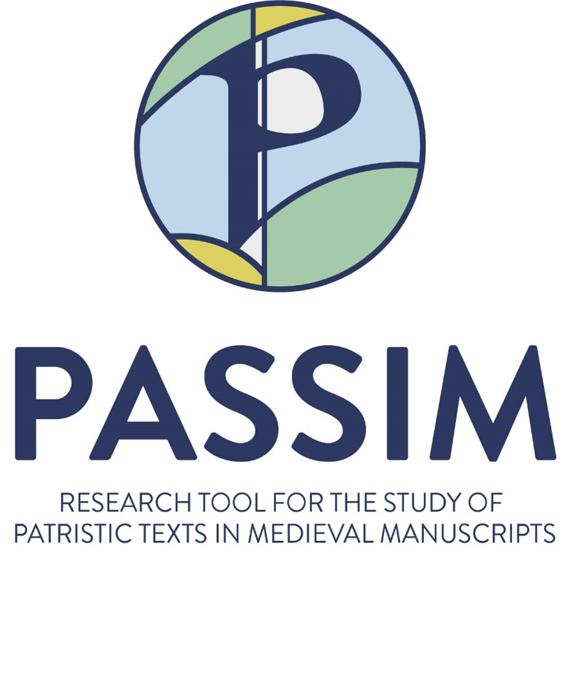

.. PassimHelp documentation master file, created by
   sphinx-quickstart on Thu May 23 09:38:35 2024.
   You can adapt this file completely to your liking, but it should at least
   contain the root `toctree` directive.

Passim User Guide
=================

This user guide explains all you would like to know about the Passim web application.
It is intended both for novices and for advanced users.

Contents:

.. toctree::
   :maxdepth: 2

   introduction
   
..   :caption: Contents:

Indices and tables
==================

* :ref:`genindex`
* :ref:`modindex`
* :ref:`search`
